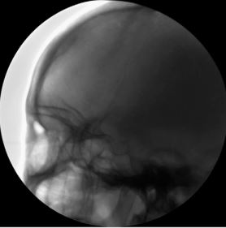

# image_enhancement
This repository contains the code of image enhancement. Image enhancement could be applied in many problems. In this project, we use image enhancement to improve the performance of segmentation model (Unet + DenseNet121). Instead of using orignial images as input of the segmentation model, we use enhanced images. It shows a better performance. The dataset we work with is coronary artery angiogram dataset.

## Introduction
Actually, there is a considerable number of techniques for image enhancement. But we use the technique named "Image enhancement using multi scale image features extracted
by top-hat transform" [1] [[paper]](https://www.sciencedirect.com/science/article/abs/pii/S0030399211001988). We implement the algorithm according to the paper. We are not sure that our implementation is correct 100% as in the paper, but the result looks good and reasonable. It is helpful for our purpose.

## Implementation
First of all, we implement some of basic morphological processing algorithms such as dilation, erosion, opening, closing, white-tophat, black-tophat. After that, multi scale image features extraction technique is used to build the image enhancement algorithms.

## Documentation
* Morphological processing: [[Standford document]](https://web.stanford.edu/class/ee368/Handouts/Lectures/2019_Winter/7-Morphological.pdf)
* Top-hat transform: [[Wikipedia]](https://en.wikipedia.org/wiki/Top-hat_transform)

## Results
Example results for the image enhancement provided :

Input Image            |  Output Enhanced Image
:-------------------------:|:-------------------------:
  |  
  |  

## References
`
[1] X. Bai , F. Zhou , B. Xue , Image enhancement using multi scale image features extracted by top-hat transform, Optics & Laser Technology 44 (2) (2012) 328–336 . 
`

